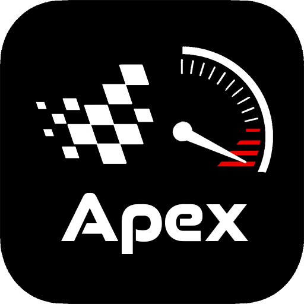
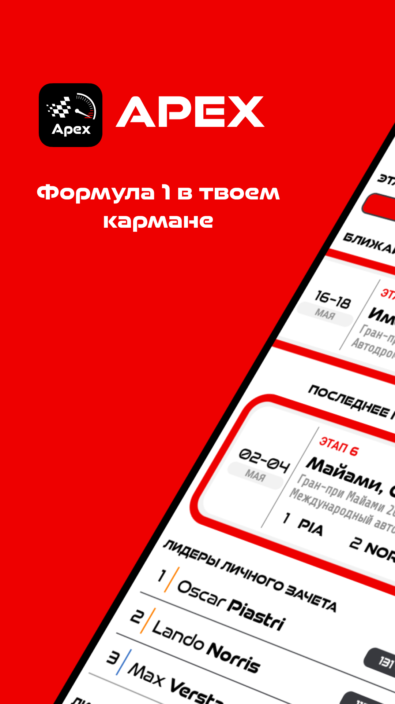
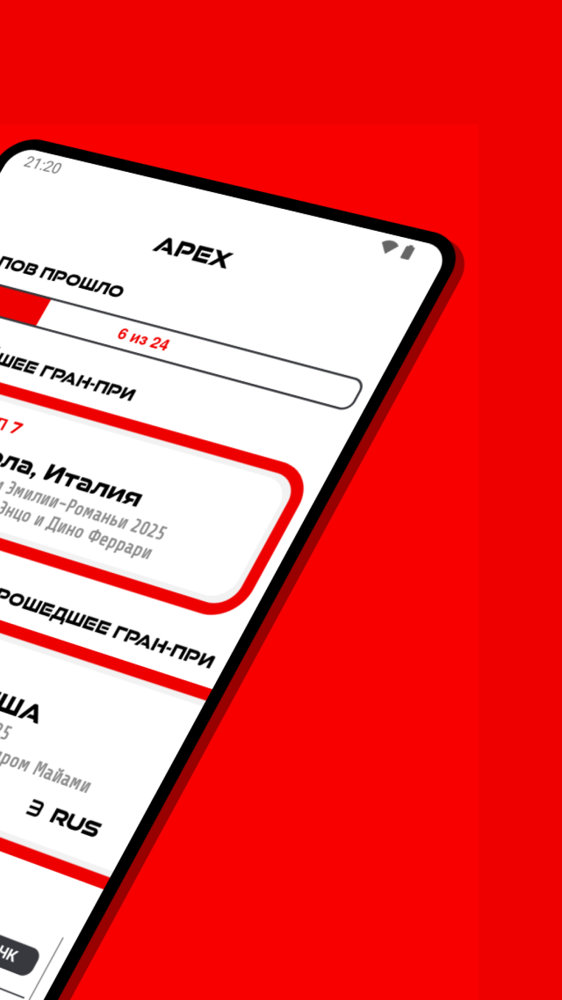
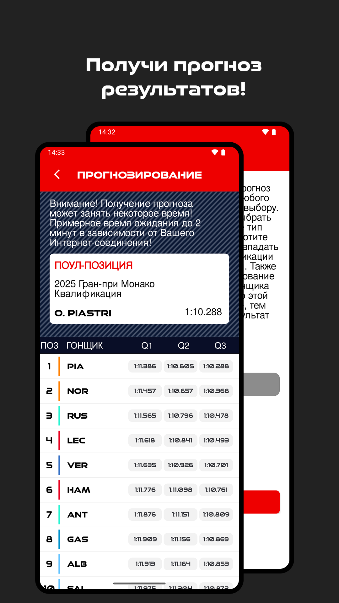
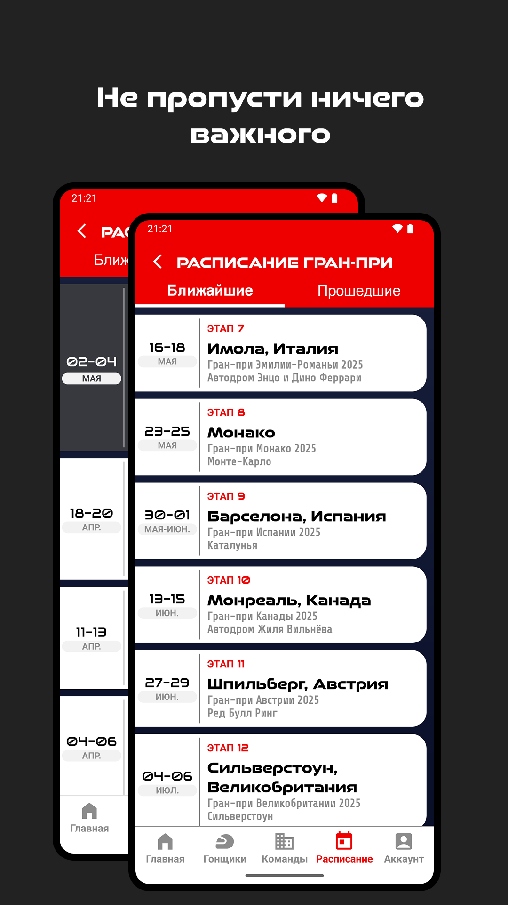
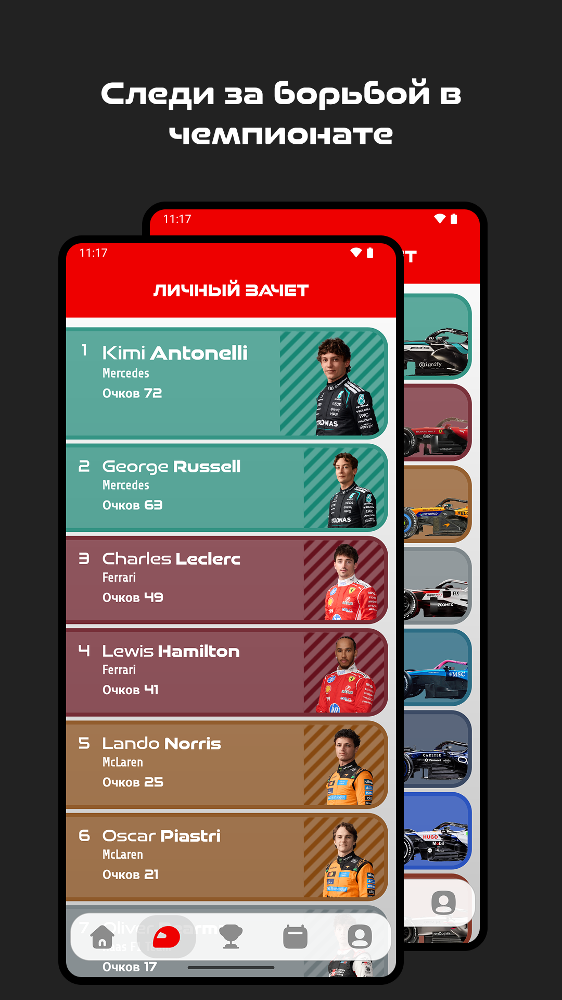
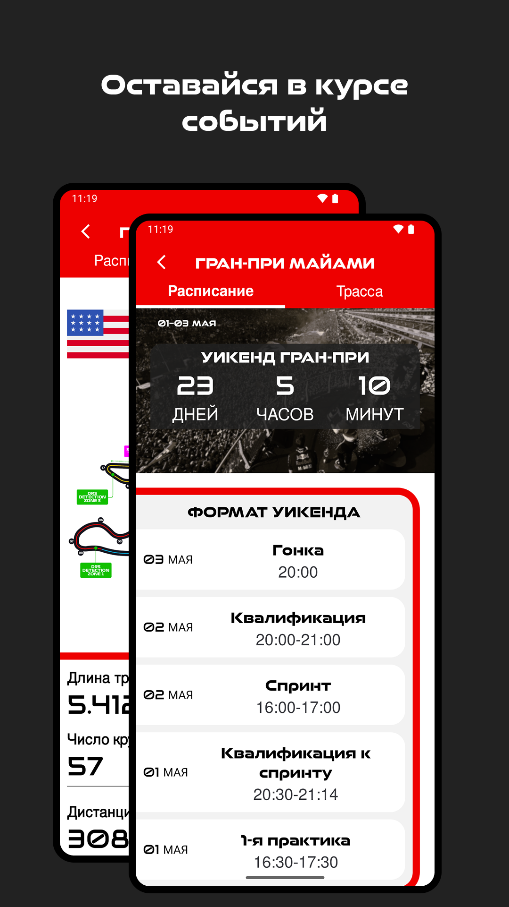
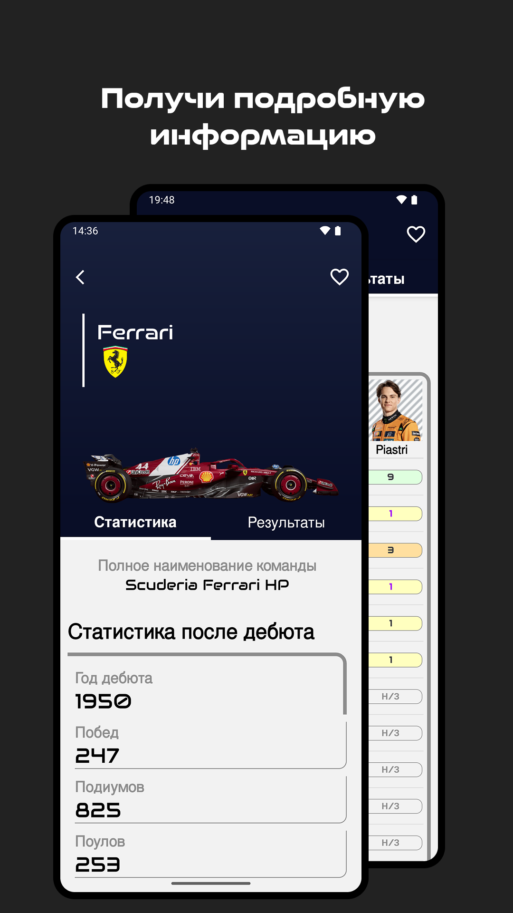
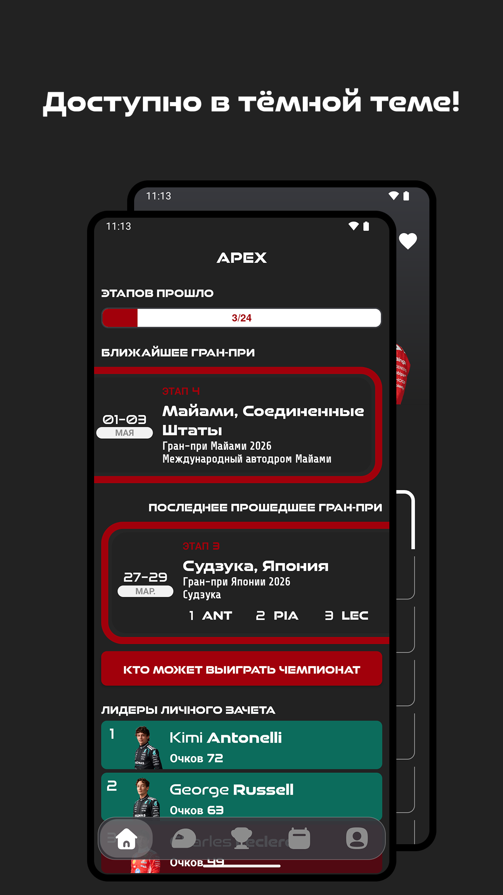
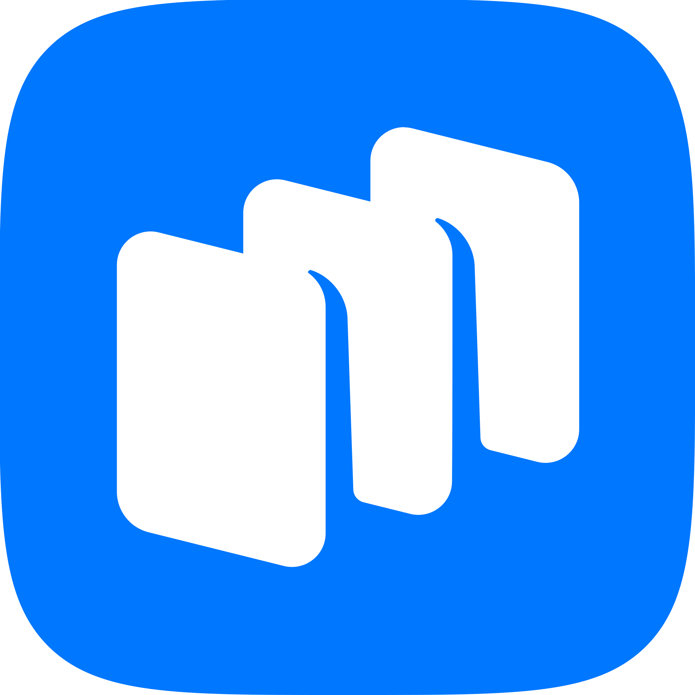

<p align="center">
  
</p>

<h1 align="center" style="margin-top: 0; margin-bottom: 0;">Apex<br>Формула 1 в твоем кармане</h1>

**Apex** — это полностью бесплатное мобильное приложение для Android, написанное на Java, которое предоставляет подробную статистику по сезонам, гонщикам и командам Формулы 1. Приложение отображает результаты, расписание гонок, личный и командный зачёты, а также различные аналитические данные.


## Функционал

- Просмотр статистики пилотов и команд за их карьеру  
- Отображение актуального личного и командного зачётов
- Расписание предстоящих и прошедших гонок  
- Подробные страницы гонок с информацией о трассе и результатами  
- Математический расчет теоретически возможных претендентов на чемпионство
- Авторизация и регистрация пользователей через Firebase Authentication
- Интеграция с Firebase Realtime Database и Cloud Storage для хранения данных и изображений  
- Модель искусственного интеллекта для предсказания результатов квалификационного круга (через Firebase Cloud Functions)  
- Push-уведомления о важных событиях
- Тёмная тема  


## Скриншоты

<p align="center">
  
  
  
  
  
  
  
  
</p>


## Доступно в магазине

Приложение **Apex** доступно для скачивания в RuStore:

<p align="center">
  <a href="https://www.rustore.ru/catalog/app/com.example.f1app">
    
  </a>
</p>


## Требования к мобильному устройству

- Свободное место на накопителе: не менее 50 МБ;
- Операционная система: Android версии не ниже 8.0 (API level 26);
- Подключение к интернету для загрузки актуальных данных  


## Установка

1. Клонируйте репозиторий:
```
git clone https://github.com/qum11ch/Apex.git
```

2. Откройте проект в Android Studio.

3. Настройте Firebase и добавьте `google-services.json`.

4. Соберите и запустите приложение.


## Лицензия

MIT License. Подробнее в файле LICENSE.


## Контакты

Если у вас есть вопросы или предложения, вы можете связаться с автором проекта:

Email: f1.app@mail.ru

Email: sharapatov.n@mail.ru

GitHub: https://github.com/qum11ch


## Отказ от ответственности / Disclaimer

Это приложение является неофициальным и никак не связано с компаниями Формулы-1.  
F1, FORMULA ONE, FORMULA 1, FIA FORMULA ONE WORLD CHAMPIONSHIP, GRAND PRIX и связанные с ними знаки являются торговыми марками Formula One Licensing B.V.

This application is unofficial and is not associated in any way with the Formula 1 companies.  
F1, FORMULA ONE, FORMULA 1, FIA FORMULA ONE WORLD CHAMPIONSHIP, GRAND PRIX and related marks are trade marks of Formula One Licensing B.V.
